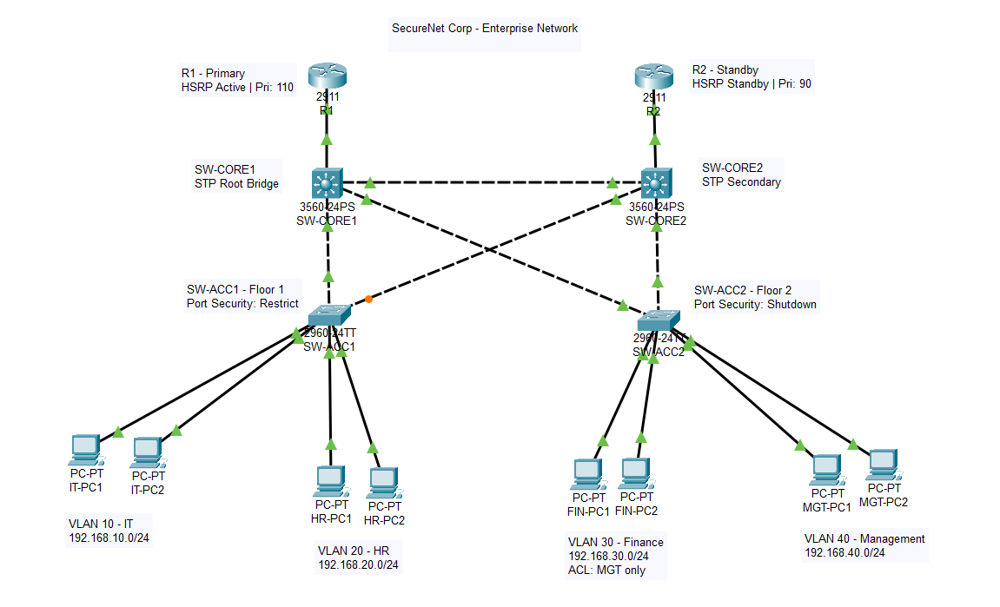

# SecureNet-Enterprise-Network

## Project Overview
Multi-floor enterprise network designed for a 4-department organization 
using Cisco Packet Tracer.

## Problem Statement
Existing flat network caused security vulnerabilities, excessive broadcast 
traffic, and had no redundancy. This project redesigns the network with 
full departmental isolation and zero single point of failure.

## Technologies Used
- VLAN Segmentation (VLAN 10, 20, 30, 40)
- Inter-VLAN Routing (Router-on-a-Stick)
- DHCP (per-VLAN pools)
- Extended ACL (Finance protection, HR isolation)
- HSRP (dual-router gateway redundancy)
- STP (loop prevention, root bridge election)
- Port Security (sticky MAC, violation modes)

## Network Topology

## VLAN Table
| VLAN | Name       | Subnet           | HSRP VIP       |
|------|------------|------------------|----------------|
| 10   | IT         | 192.168.10.0/24  | 192.168.10.1   |
| 20   | HR         | 192.168.20.0/24  | 192.168.20.1   |
| 30   | Finance    | 192.168.30.0/24  | 192.168.30.1   |
| 40   | Management | 192.168.40.0/24  | 192.168.40.1   |

## Files
- `SecureNet_Corp.pkt` – Cisco Packet Tracer project file
- `topology.png` – Network topology diagram
- `SecureNet_Network_Project.docx` – Full project documentation

## Author
Ipek Yengin | Uludag University – Management Information Systems
